# 修改后的 Deb 包转换流程详细分析

## 概述

修改后的 deb 包转换流程使用内置的 Python 模块 `deb_converter.py` 实现了完整的转换流程，不再依赖外部的 `linyaps-pica-helper.sh` 脚本。该流程集成了 ll-pica convert、构建、兼容性测试、依赖修复和 layer 导出等功能。

## 架构设计

```
convert_package.sh (Shell 入口)
    ↓
deb_converter.py (Python 主模块)
    ↓
├── compat_checker.py (兼容性测试模块)
├── dependency_analyzer.py (依赖分析模块)
└── dependency_fixer.py (依赖修复模块)
```

## 完整流程图

```mermaid
flowchart TD
    Start([开始 deb 转换]) --> Init[初始化 DebConverter]
    Init --> CheckReqs[检查前置要求]
    
    CheckReqs --> ReqsOK{要求满足?}
    ReqsOK -->|否| EndFail([结束 - 失败])
    ReqsOK -->|是| Phase1
    
    Phase1[Phase 1: ll-pica convert]
    Phase1 --> PicaSuccess{转换成功?}
    PicaSuccess -->|否| EndFail
    PicaSuccess -->|是| ParseCSV[解析 final-missing CSV]
    
    ParseCSV --> HasCSV{有 CSV 数据?}
    HasCSV -->|是| UpdateYAML[更新 linglong.yaml]
    HasCSV -->|否| Phase2
    UpdateYAML --> Phase2
    
    Phase2[Phase 2: 初始构建]
    Phase2 --> BuildSuccess{构建成功?}
    BuildSuccess -->|否| EndFail
    BuildSuccess -->|是| UpdateFilesTar[更新 files.tar.zst]
    
    UpdateFilesTar --> CheckCompat{启用兼容性测试?}
    CheckCompat -->|否| Phase4
    CheckCompat -->|是| Phase3
    
    Phase3[Phase 3: 兼容性测试]
    Phase3 --> CompatSuccess{测试通过?}
    CompatSuccess -->|是| Phase4
    CompatSuccess -->|否| CheckBuildFailed{构建失败?}
    
    CheckBuildFailed -->|否| EndFail
    CheckBuildFailed -->|是| FixAttempt1[Phase 3: 依赖修复尝试 1]
    
    FixAttempt1 --> CheckMaxAttempts{超过最大<br/>尝试次数?}
    CheckMaxAttempts -->|是| Phase6
    CheckMaxAttempts -->|否| AnalyzeDeps[分析缺失依赖]
    
    AnalyzeDeps --> FoundPackages{找到缺失包?}
    FoundPackages -->|是| Mode0[模式0: 追加运行时依赖]
    FoundPackages -->|否| ScanNonStd[模式2: 扫描非标准目录库]
    
    Mode0 --> Mode0Success{模式0成功?}
    Mode0Success -->|是| UpdateTarDeps[更新 files.tar.zst]
    Mode0Success -->|否| Mode1[模式1: 下载安装依赖]
    
    Mode1 --> Mode1Success{模式1成功?}
    Mode1Success -->|是| MergeDeps[合并依赖到 files 目录]
    Mode1Success -->|否| ScanNonStd
    
    MergeDeps --> UpdateYamlDeps[更新 linglong.yaml<br/>buildext.apt.depends]
    UpdateYamlDeps --> UpdateTarDeps
    
    ScanNonStd --> CreateSymlinks[创建软链接]
    CreateSymlinks --> UpdateTarSymlinks[更新 files.tar.zst]
    
    UpdateTarDeps --> Phase4Rebuild[Phase 4: 重建]
    UpdateTarSymlinks --> Phase4Rebuild
    
    Phase4Rebuild --> RebuildSuccess{重建成功?}
    RebuildSuccess -->|否| Phase6
    RebuildSuccess -->|是| Phase5
    
    Phase5[Phase 5: 修复后兼容性测试]
    Phase5 --> RecheckCompat{测试通过?}
    RecheckCompat -->|是| Phase4
    RecheckCompat -->|否| IncrementAttempts[增加尝试次数]
    IncrementAttempts --> FixAttempt1
    
    Phase6[Phase 6: 最终构建<br/>跳过测试]
    Phase6 --> FinalBuildSuccess{最终构建成功?}
    FinalBuildSuccess -->|否| EndFail
    FinalBuildSuccess -->|是| Phase4
    
    Phase4[Phase 4: 导出 layer]
    Phase4 --> ExportLayer{启用 layer 导出?}
    ExportLayer -->|否| EndSuccess
    ExportLayer -->|是| DoExport[执行 layer 导出]
    
    DoExport --> ExportSuccess{导出成功?}
    ExportSuccess -->|否| EndSuccess
    ExportSuccess -->|是| StoreLayer[存储 layer]
    
    StoreLayer --> EndSuccess([结束 - 成功])
    
    style Start fill:#e1f5e1
    style EndSuccess fill:#e1f5e1
    style EndFail fill:#ffe1e1
    style Phase1 fill:#e1f0ff
    style Phase2 fill:#e1f0ff
    style Phase3 fill:#fff4e1
    style Phase4 fill:#e1f0ff
    style Phase5 fill:#fff4e1
    style Phase6 fill:#ffe1e1
```



## 详细流程说明

### 1. 初始化阶段

```python
def __init__(
    self,
    deb_file: Path,
    workdir: Path,
    enable_compact_check: bool = True,
    compact_check_timeout: int = 30,
    enable_layer_export: bool = True,
    ll_stored_pool: Optional[Path] = None,
    final_missing_csv: Optional[Path] = None,
    verbose: bool = False
):
```

**功能：**
- 解析 deb 文件路径和工作目录
- 获取 deb 包信息（包名、版本、架构）
- 创建派生目录结构
- 初始化状态跟踪变量
- 初始化子模块（CompatChecker、DependencyAnalyzer、DependencyFixer）

**派生目录：**
```
workdir/
├── pica-work/
│   └── package/
│       └── {deb_id}/
│           ├── linglong.yaml
│           ├── files/
│           ├── files.tar.zst
│           └── linglong/
│               └── output/
│                   └── binary/
│                       └── files/
└── StoredPool/
    └── {layer_file}
```

**状态变量：**
- `build_status` - 构建状态（not-started, passed, failed, timeout, error）
- `compact_check_status` - 兼容性测试状态（N/A, passed, failed）
- `layer_export_status` - layer 导出状态（N/A, passed, failed, timeout, error）
- `fix_attempts` - 修复尝试次数

### 2. Phase 1: ll-pica convert

```python
def _execute_pica_convert(self) -> bool:
    """执行 ll-pica convert"""
    cmd = [
        "ll-pica",
        "convert",
        "-c", str(self.deb_file),
        "-w", str(self.pica_workdir)
    ]
    subprocess.run(cmd, ...)
```

**功能：**
- 使用 ll-pica convert 将 deb 包转换为玲珑包格式
- 生成初始的 linglong.yaml 和文件结构
- 超时时间：1 小时

**输出：**
- `linglong.yaml` - 玲珑包配置文件
- `files/` - 应用文件目录
- 其他必要的元数据文件

### 3. 解析 final-missing CSV 文件

```python
def _parse_final_missing_csv(self) -> Tuple[str, str, str, str]:
    """解析 final-missing CSV 文件"""
    # CSV 格式: DEB应用名称^Sys-repo-pkgname^ll_version^ll_id
    # 返回: (origName, origDebID, origDebVer, newID)
```

**功能：**
- 解析 final-missing CSV 文件
- 获取新的包 ID 和名称
- 用于更新 linglong.yaml

**CSV 格式：**
```
DEB应用名称^Sys-repo-pkgname^ll_version^ll_id
应用名称^原始deb_id^原始版本^新ID
```

### 4. 更新 linglong.yaml

```python
def _update_yaml_id_and_name(
    self,
    yaml_file: Path,
    new_id: str,
    new_name: str,
    orig_deb_id: str
) -> bool:
    """更新 linglong.yaml 的 id 和 name 字段"""
```

**功能：**
- 更新 `id` 字段
- 更新 `name` 字段
- 更新 `command` 字段中的 deb_id 引用
- 更新 `build` 段中的 deb_id 引用（跳过 EXTERNAL 前缀）

### 5. Phase 2: 初始构建

```python
def _execute_build(self, skip_output_check: bool = False) -> Tuple[bool, str]:
    """执行构建"""
    cmd = ["ll-builder", "build"]
    if skip_output_check:
        cmd.append("--skip-output-check")
    subprocess.run(cmd, ...)
```

**功能：**
- 使用 ll-builder build 构建玲珑包
- 超时时间：1 小时
- 构建成功后更新 files.tar.zst 归档

**退出码处理：**
- `0` - 构建成功
- `255` - 构建失败（可能是依赖问题）
- 其他 - 构建失败

### 6. 更新 files.tar.zst

```python
def _update_files_tar(self) -> bool:
    """更新 files.tar.zst 归档"""
    built_files_dir = self.app_build_dir / "linglong" / "output" / "binary" / "files"
    # 使用 zstd 压缩创建归档
```

**功能：**
- 从构建输出目录创建 files.tar.zst 归档
- 使用 zstd 压缩以提高性能
- 用于后续重建时快速恢复文件

### 7. Phase 3: 兼容性测试

```python
def check(self) -> Tuple[bool, str]:
    """执行兼容性测试"""
    result = subprocess.run(
        ["timeout", str(self.timeout), "ll-builder", "run"],
        cwd=self.build_dir,
        ...
    )
```

**功能：**
- 使用 `timeout` 命令执行 ll-builder run
- 默认超时时间：30 秒
- 验证应用是否能正常启动

**退出码处理：**
- `124` - 超时，视为测试通过（应用已成功启动）
- `0` - 正常退出，测试通过
- 其他 - 测试失败，保存错误日志

**错误日志：**
- 保存到 `compat-check-errors/run-error.log`

### 8. 依赖修复流程

#### 8.1 分析缺失依赖

```python
def analyze_missing_deps(self, force_update_cache: bool = False) -> Tuple[bool, List[str]]:
    """分析缺失的依赖"""
    # 使用 ldd 检测缺失的动态库
    # 使用 apt-file search 查找提供这些库的包
    # 并行处理以提高性能
```

**功能：**
- 使用 `ldd` 检测缺失的动态库
- 使用 `apt-file search` 查找提供这些库的包
- 并行处理以提高性能
- 生成 `missing_deps.csv` 和 `missing-libs.packages`

**输出文件：**
- `missing_deps.csv` - 缺失的依赖列表
- `missing-libs.packages` - 匹配的包列表

#### 8.2 依赖修复的3个模式

当兼容性测试失败时，系统会按顺序尝试以下3个修复模式：

##### 模式0：运行时依赖（最轻量）

```python
def _update_yaml_with_runtime_depends(self, packages: List[str]) -> bool:
    """向 linglong.yaml 的 depends 字段追加运行时依赖"""
    # 读取 linglong.yaml
    # 合并现有的 depends
    # 去重并添加新依赖
    # 写回文件
```

**功能：**
- 向 `linglong.yaml` 的 `depends` 字段追加缺失的依赖包名
- 这些依赖由运行时环境（runtime/base）提供
- 不会打包到应用中

**优点：**
- 最轻量，不增加包体积
- 符合玲珑最佳实践
- 依赖由运行时环境统一管理

**缺点：**
- 依赖运行时环境提供这些包
- 如果运行时环境不包含这些包，应用仍无法运行

**适用场景：**
- 缺失的依赖是常见的系统库
- 运行时环境（如 `org.deepin.runtime.dtk`）已经包含这些依赖

##### 模式1：构建时依赖（中等）

```python
def download_and_install_dependencies(self, packages: List[str]) -> Tuple[bool, Path]:
    """下载并安装依赖"""
    # apt download <packages>
    # dpkg -x <package.deb> <extracted_dir>
    # 合并到 files 目录
```

**功能：**
- 使用 `apt download` 下载依赖包
- 使用 `dpkg -x` 解压到临时目录
- 合并到 files 目录
- 更新 linglong.yaml 添加 buildext.apt.depends

**优点：**
- 确保依赖可用，不依赖运行时环境
- 可以精确控制依赖版本

**缺点：**
- 增加包体积
- 依赖更新需要重新打包

**适用场景：**
- 缺失的依赖不在运行时环境中
- 需要特定版本的依赖

##### 模式2：非标准目录库（最重）

```python
def scan_non_std_dir_libraries(self, ...) -> Tuple[bool, List[str]]:
    """扫描非标准目录中的库"""
    # 在 files 目录中查找缺失的库
    # 创建软链接到 files/lib 目录
```

**功能：**
- 在 files 目录中查找缺失的库
- 创建软链接到 files/lib 目录
- 支持通配符匹配（如 `libcdio.so.19*`）

**优点：**
- 可以处理特殊情况的库
- 不需要下载额外的包

**缺点：**
- 最不稳定，可能找到错误的库
- 软链接可能失效
- 不符合玲珑的最佳实践

**适用场景：**
- 缺失的库在应用的非标准目录中
- 其他模式都失败时的最后尝试

**修复流程：** 模式0 → 模式1 → 模式2，每个模式失败后自动尝试下一个模式。

#### 8.4 重建

```python
def scan_non_std_dir_libraries(self, ...) -> Tuple[bool, List[str]]:
    """扫描非标准目录中的库"""
    # 在 files 目录中查找缺失的库
    # 创建软链接到 files/lib 目录
```

**功能：**
- 在 files 目录中查找缺失的库
- 创建软链接到 files/lib 目录
- 支持通配符匹配（如 `libcdio.so.19*`）

**输出文件：**
- `nonStrDir_found_libs.csv` - 在非标准目录中找到的库

#### 8.4 重建

```python
def _execute_build(self, skip_output_check: bool = False) -> Tuple[bool, str]:
    """执行构建"""
    # 使用修复后的依赖重新构建
```

**功能：**
- 使用修复后的依赖重新构建
- 更新 files.tar.zst 归档

#### 8.5 修复后兼容性测试

```python
def check(self) -> Tuple[bool, str]:
    """执行兼容性测试"""
    # 验证修复是否成功
```

**功能：**
- 验证修复是否成功
- 如果通过，流程结束
- 如果失败，增加尝试次数，继续下一轮修复

### 9. Phase 6: 最终构建

```python
def _attempt_final_build(self) -> Tuple[bool, str]:
    """执行最终构建（无输出检查）"""
    cmd = ["ll-builder", "build", "--skip-output-check"]
    subprocess.run(cmd, ...)
```

**功能：**
- 执行无测试的最终构建
- 跳过输出检查
- 即使兼容性测试未通过，也尝试生成可用的包

**触发条件：**
- 超过最大修复尝试次数（3 次）
- 所有修复尝试都失败

### 10. Phase 4: 导出 layer

```python
def _export_layer(self) -> bool:
    """导出 layer"""
    cmd = [
        "ll-builder",
        "export",
        "--no-develop",
        "--layer",
        "-z", "zstd"
    ]
    subprocess.run(cmd, ...)
```

**功能：**
- 使用 ll-builder export 导出 layer
- 使用 zstd 压缩
- 超时时间：1 小时

**输出：**
- `{deb_id}_{arch}_binary.layer` - layer 文件

### 11. 存储 layer

```python
def _store_layer(self) -> bool:
    """存储 layer"""
    # 根据兼容性测试结果选择存储位置
    if self.compact_check_status == "passed":
        target_dir = self.ll_stored_pool
    else:
        target_dir = self.ll_stored_pool / "forceTested"
```

**功能：**
- 根据兼容性测试结果选择存储位置
- 兼容性测试通过：存储到 `StoredPool/`
- 兼容性测试未通过：存储到 `StoredPool/forceTested/`

## 状态管理

### 构建状态（build_status）

| 状态 | 说明 |
|------|------|
| `not-started` | 构建未开始 |
| `passed` | 构建成功 |
| `failed` | 构建失败 |
| `timeout` | 构建超时 |
| `error` | 构建错误 |

### 兼容性测试状态（compact_check_status）

| 状态 | 说明 |
|------|------|
| `N/A` | 未执行或禁用 |
| `passed` | 测试通过 |
| `failed` | 测试失败 |

### Layer 导出状态（layer_export_status）

| 状态 | 说明 |
|------|------|
| `N/A` | 未执行或禁用 |
| `passed` | 导出成功 |
| `failed` | 导出失败 |
| `timeout` | 导出超时 |
| `error` | 导出错误 |

### 修复尝试次数（fix_attempts）

- 默认最大尝试次数：3
- 每次失败后自动增加
- 超过最大次数后执行最终构建

## 输出文件

| 文件 | 说明 |
|------|------|
| `linglong.yaml` | 玲珑包配置文件 |
| `missing_deps.csv` | 缺失的依赖列表（由 ldd 检测） |
| `missing-libs.packages` | 匹配的包列表（由 apt-file 分析） |
| `nonStrDir_found_libs.csv` | 在非标准目录中找到的库 |
| `files.tar.zst` | 应用文件的压缩归档（使用 zstd 压缩） |
| `compat-check-errors/run-error.log` | 兼容性测试错误日志 |
| `{deb_id}_{arch}_binary.layer` | 导出的 layer 文件 |

## 使用示例

### 基本转换

```bash
bash scripts/convert_package.sh deb ./demo.deb
```

### 禁用兼容性测试

```bash
bash scripts/convert_package.sh deb ./demo.deb --no-compact-check
```

### 自定义兼容性测试超时时间

```bash
bash scripts/convert_package.sh deb ./demo.deb --compact-check-timeout 60
```

### 禁用 layer 导出

```bash
bash scripts/convert_package.sh deb ./demo.deb --no-layer-export
```

### 指定 final-missing CSV 文件

```bash
bash scripts/convert_package.sh deb ./demo.deb --final-missing-csv /path/to/final-missing.csv
```

### 指定 layer 存储目录

```bash
bash scripts/convert_package.sh deb ./demo.deb --ll-stored-pool /path/to/StoredPool
```

### 显示详细输出

```bash
bash scripts/convert_package.sh deb ./demo.deb --verbose
```

### 直接使用 Python 模块

```bash
python3 scripts/deb_converter.py ./demo.deb \
  --workdir /tmp/pica-work \
  --enable-compact-check \
  --compact-check-timeout 30 \
  --enable-layer-export \
  --ll-stored-pool /tmp/StoredPool \
  --verbose
```

## 关键特性

### 1. 自动依赖修复

- 最多尝试 3 次修复
- 支持两种修复策略：
  - 下载并安装依赖包
  - 扫描非标准目录中的库并创建软链接
- 自动更新 linglong.yaml

### 2. 兼容性测试

- 默认启用，超时时间 30 秒
- 超时视为测试通过（应用已成功启动）
- 保存错误日志便于调试

### 3. Layer 导出

- 默认启用
- 根据兼容性测试结果选择存储位置
- 使用 zstd 压缩

### 4. 状态跟踪

- 详细的构建、测试、导出状态
- 修复尝试次数跟踪
- 便于调试和问题定位

### 5. 错误处理

- 完善的异常处理
- 详细的错误消息
- 适当的退出码

## 优势

1. **完全内置** - 不再依赖外部脚本
2. **Python 实现** - 更易于维护和扩展
3. **模块化设计** - 功能分离，便于测试和复用
4. **类型提示** - 使用 Python 类型提示，提高代码质量
5. **错误处理** - 更好的错误处理和日志记录
6. **向后兼容** - 保持了原有的命令行接口

## 总结

修改后的 deb 包转换流程实现了完整的转换功能，包括：

1. ✅ ll-pica convert 转换
2. ✅ 构建管理
3. ✅ 兼容性测试
4. ✅ 依赖分析和修复
5. ✅ 非标准目录库扫描
6. ✅ Layer 导出和存储
7. ✅ YAML 更新
8. ✅ 状态跟踪
9. ✅ 错误处理

流程设计合理，功能完整，易于维护和扩展。
