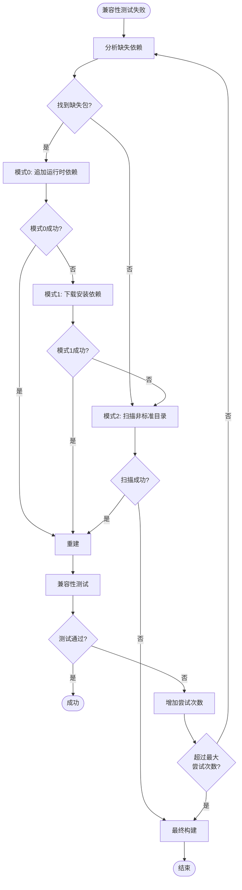

# 依赖修复模式说明

本文档详细说明 deb 包转换过程中的3个依赖修复模式。

## 概述

当兼容性测试失败时，deb 转换器会自动尝试修复缺失的依赖。修复过程按顺序尝试3个模式，从最轻量到最重：

1. **模式2（最轻量）**：扫描非标准目录中的库，创建软链接 - 不增加体积，提高运行库复用率
2. **模式0（中等）**：向 `linglong.yaml` 的 `depends` 字段追加运行时依赖 - 不增加体积，但依赖运行时环境
3. **模式1（最重）**：下载并安装依赖包，更新 `buildext.apt.depends` - 增加包体积，但确保依赖可用

**修复流程**：每次修复尝试只尝试一个模式，按顺序：模式2 → 模式0 → 模式1。每次修复后都会重建并重新测试，最多尝试3次（对应3个模式）。

## 模式2：软链接（最轻量）

### 描述

向 `linglong.yaml` 的 `depends` 字段追加缺失的依赖包名。这些依赖由运行时环境（runtime/base）提供，不会打包到应用中。

### 优点

### 描述

扫描应用的 `files` 目录，在非标准目录中查找缺失的库文件，并为这些库创建软链接到 `files/lib` 目录。

### 优点

- ✅ 最轻量，不增加包体积
- ✅ 提高运行库复用率，多个应用可以共享同一个库
- ✅ 适用于应用自带但不在标准位置的库
- ✅ 不依赖外部包管理器

### 缺点

- ❌ 只适用于应用自带的库
- ❌ 如果库不在应用中，无法修复
- ❌ 软链接可能不稳定，如果源文件被删除

### 适用场景

- 应用自带了缺失的库，但不在标准库目录中
- 库文件在应用的 `opt/`、`usr/local/` 等非标准目录中
- 希望最大化库的复用率

### 实现细节

```python
def scan_non_std_dir_libraries(self, app_installed_files_dir: Optional[Path] = None) -> Tuple[bool, List[str]]:
    """扫描非标准目录中的库"""
    # 在 files 目录中查找缺失的库
    # 跳过标准库目录（lib, lib64, usr/lib 等）
    # 返回找到的库列表

def create_symlinks_for_libraries(self, libraries: List[str], source_dir: Path, target_lib_dir: Path) -> Tuple[bool, List[str]]:
    """为库创建软链接到 lib 目录"""
    # 在源目录中查找匹配的库文件
    # 创建相对软链接到目标 lib 目录
    # 返回创建的软链接列表
```

### 示例

**修复前：**
```
files/
├── opt/
│   └── myapp/
│       └── lib/
│           └── libmylib.so.1
└── bin/
    └── myapp
```

**修复后：**
```
files/
├── opt/
│   └── myapp/
│       └── lib/
│           └── libmylib.so.1
├── lib/
│   └── libmylib.so.1 -> ../../opt/myapp/lib/libmylib.so.1
└── bin/
    └── myapp
```

## 模式0：运行时依赖（中等）

### 描述

向 `linglong.yaml` 的 `depends` 字段追加缺失的依赖包名。这些依赖由运行时环境（runtime/base）提供，不会打包到应用中。

### 优点

- ✅ 不增加包体积
- ✅ 依赖由运行时环境统一管理，便于更新
- ✅ 符合玲珑的最佳实践

### 缺点

- ❌ 依赖运行时环境提供这些包
- ❌ 如果运行时环境不包含这些包，应用仍无法运行

### 适用场景

- 缺失的依赖是常见的系统库
- 运行时环境（如 `org.deepin.runtime.dtk`）已经包含这些依赖
- 希望保持包体积最小

### 实现细节

```python
def _update_yaml_with_runtime_depends(self, packages: List[str]) -> bool:
    """向 linglong.yaml 的 depends 字段追加运行时依赖"""
    # 读取 linglong.yaml
    # 合并现有的 depends
    # 去重并添加新依赖
    # 写回文件
```

### 示例

**修复前：**
```yaml
package: io.github.example.app
version: 1.0.0.0
depends:
  - org.deepin.runtime.dtk/23.1.0
```

**修复后：**
```yaml
package: io.github.example.app
version: 1.0.0.0
depends:
  - org.deepin.runtime.dtk/23.1.0
  - libglib2.0-0
  - libgtk-3-0
```

## 模式1：构建时依赖（最重）

### 描述

下载缺失的依赖包，解压到应用的 `files` 目录，并更新 `linglong.yaml` 的 `buildext.apt.depends` 字段。

### 优点

- ✅ 确保依赖可用，不依赖运行时环境
- ✅ 适用于运行时环境不包含的依赖
- ✅ 可以精确控制依赖版本

### 缺点

- ❌ 增加包体积（最重）
- ❌ 依赖更新需要重新打包应用
- ❌ 可能与其他应用产生依赖冲突

### 适用场景

- 缺失的依赖不在运行时环境中
- 需要特定版本的依赖
- 应用对依赖版本有严格要求
- 前面的模式都失败后的最后选择

### 实现细节

```python
def download_and_install_dependencies(self, packages: List[str]) -> Tuple[bool, Path]:
    """下载并安装依赖包"""
    # apt download <packages>
    # dpkg -x <package.deb> <extracted_dir>
    # 合并到 files 目录
```

### 示例

**修复前：**
```yaml
package: io.github.example.app
version: 1.0.0.0
buildext:
  apt:
    depends: []
```

**修复后：**
```yaml
package: io.github.example.app
version: 1.0.0.0
buildext:
  apt:
    depends:
      - libglib2.0-0
      - libgtk-3-0
```

**文件结构：**
```
files/
├── usr/
│   ├── lib/
│   │   ├── x86_64-linux-gnu/
│   │   │   ├── libglib-2.0.so.0
│   │   │   └── libgtk-3.so.0
```

## 模式2：非标准目录库（最重）

### 描述

扫描应用的 `files` 目录，在非标准目录中查找缺失的库，并创建软链接到 `files/lib` 目录。

### 优点

- ✅ 可以处理特殊情况的库
- ✅ 不需要下载额外的包
- ✅ 适用于应用自带的库

### 缺点

- ❌ 最不稳定，可能找到错误的库
- ❌ 软链接可能失效
- ❌ 不符合玲珑的最佳实践

### 适用场景

- 缺失的库在应用的非标准目录中
- 应用自带了某些库
- 其他模式都失败时的最后尝试

### 实现细节

```python
def scan_non_std_dir_libraries(self, ...) -> Tuple[bool, List[str]]:
    """扫描非标准目录中的库"""
    # 在 files 目录中查找缺失的库
    # 创建软链接到 files/lib 目录
```

### 示例

**修复前：**
```
files/
├── opt/
│   └── myapp/
│       └── lib/
│           └── libmylib.so.1
```

**修复后：**
```
files/
├── opt/
│   └── myapp/
│       └── lib/
│           └── libmylib.so.1
└── lib/
    └── libmylib.so.1 -> ../../opt/myapp/lib/libmylib.so.1
```

## 修复流程

### 完整流程图



### 代码流程

```python
def _analyze_and_fix_dependencies(self) -> Tuple[bool, str]:
    """分析并修复依赖（3个模式依次尝试）"""
    
    # 分析缺失的依赖
    analyze_success, packages = self.dependency_analyzer.analyze_missing_deps(...)
    
    if not packages:
        # 尝试模式2
        return self._fix_non_std_dir_libraries()
    
    # 模式0: 向 depends 字段追加运行时依赖
    if self._update_yaml_with_runtime_depends(packages):
        return True, "Fixed dependencies (Mode 0: runtime depends)"
    
    # 模式1: 下载并安装依赖包
    if self._download_and_install_dependencies(packages):
        return True, "Fixed dependencies (Mode 1: buildext.apt.depends)"
    
    # 模式2: 扫描非标准目录中的库
    return self._fix_non_std_dir_libraries()
```

## 状态跟踪

### 修复模式记录

转换器会记录使用的修复模式，并在最终状态中显示：

```
============================================================
Final Status
============================================================
Build Status: passed
Compat Check Status: passed
Fix Attempts: 1
Fix Mode Used: Mode 0 (runtime depends)
Layer Export Status: passed
```

### 模式名称映射

```python
mode_names = {
    0: "Mode 0 (runtime depends)",
    1: "Mode 1 (buildext.apt.depends)",
    2: "Mode 2 (symlinks)"
}
```

## 最佳实践

### 优先使用模式0

- 模式0是最轻量的解决方案
- 符合玲珑的设计理念
- 便于依赖的统一管理和更新

### 模式选择建议

1. **优先尝试模式0**：如果运行时环境包含缺失的依赖
2. **其次使用模式1**：如果需要特定版本的依赖
3. **最后使用模式2**：仅作为最后的尝试手段

### 避免模式2

- 模式2是最不稳定的解决方案
- 软链接可能失效
- 不符合玲珑的最佳实践

## 相关文档

- [SKILL.md](../SKILL.md) - 玲珑打包技能主文档
- [deb-conversion-flow-analysis.md](deb-conversion-flow-analysis.md) - Deb 转换流程分析
- [project-build-workflow.md](../references/project-build-workflow.md) - 项目构建工作流

## 版本历史

- **2.1.0** (2026-04-02)：添加模式0，实现完整的3模式依赖修复流程
- **2.0.0** (2026-04-01)：初始版本，只有模式1和模式2
